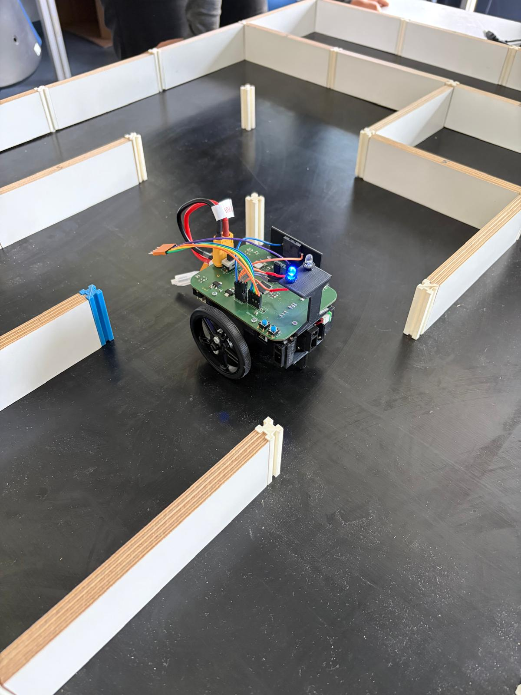
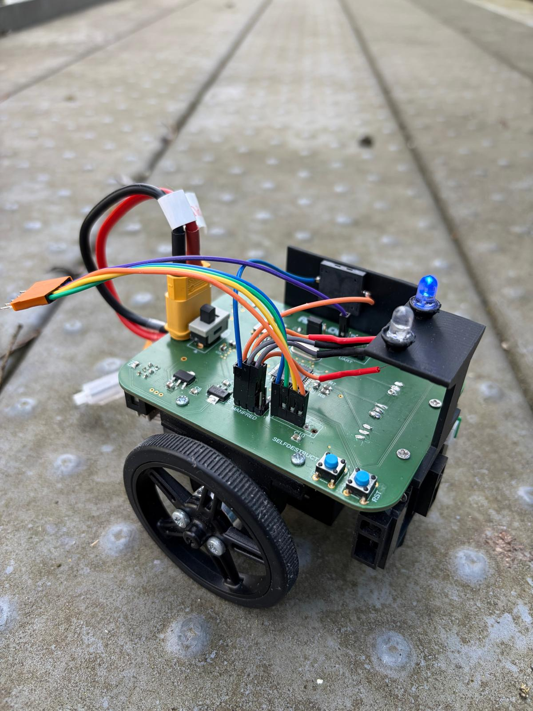
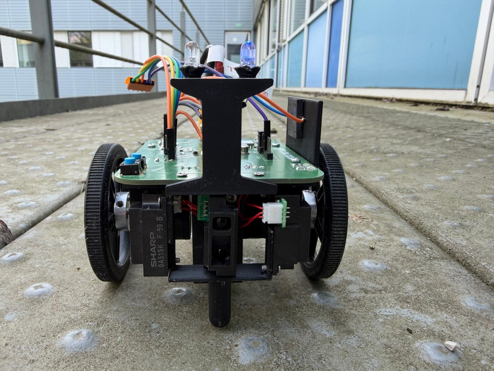
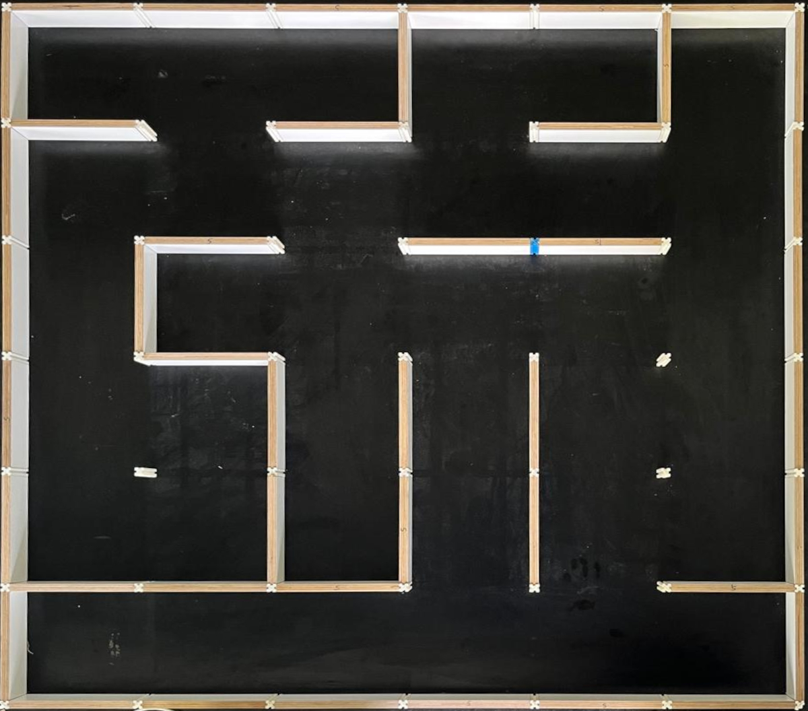
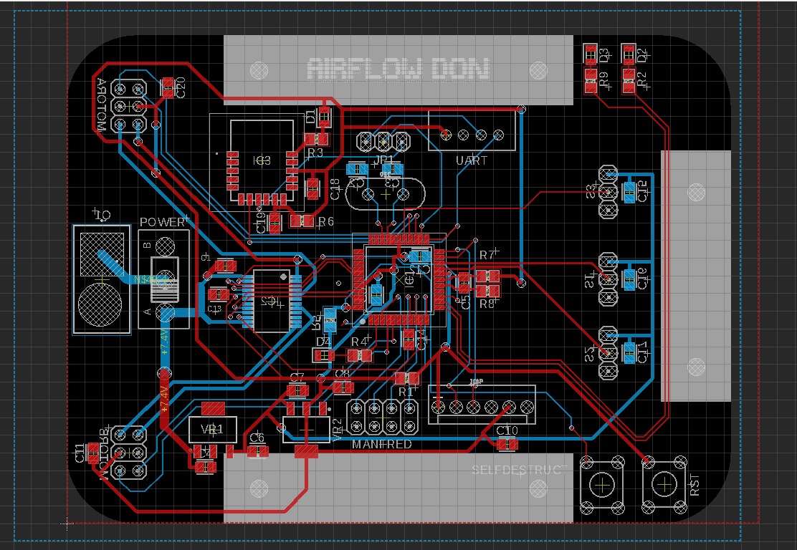

# Micromouse Robot

Custom autonomous Micromouse robot developed as a university team project in embedded systems and control. The project combines custom PCB design, dsPIC firmware, wheel-speed control, wall-based trajectory correction, and map-based maze navigation in a single robot.

Read the final report: [Airflow_Don_Report.pdf](report/Airflow_Don_Report.pdf)

  

## Overview

This project was built around the classic Micromouse idea: a small autonomous robot that explores a maze and then drives to a goal using the map it created.  
For the scope of this academic project, the full competition problem was intentionally reduced to a `6 x 6` maze with a predefined goal. That made it possible to complete the full engineering chain, from hardware design to firmware, control, testing, and technical documentation, within one project.

The result is a working prototype that can:

- detect walls with three infrared sensors
- regulate wheel speed in closed loop using encoder feedback
- correct its trajectory during straight motion using wall-based trim control
- explore a reduced maze while building an internal map
- return and later drive to a predefined goal using the stored map

## What We Built

### Hardware

- Custom PCB centered around a `dsPIC33FJ128MC804`
- Differential-drive platform with two DC gear motors
- Quadrature encoders connected to hardware QEI peripherals
- Three analog IR distance sensors for left, front, and right wall detection
- `TB6612FNG` dual H-bridge motor driver
- On-board voltage regulation from battery to `5 V` and `3.3 V`
- UART + BLE debugging interface using `RN4871`

### Firmware

- Layered embedded architecture with `src/hal`, `src/drivers`, `src/control`, and `src/app`
- Interrupt-driven runtime with a `10 ms` control/update loop
- ADC + DMA based sensor acquisition
- Encoder-based speed and distance estimation
- Maze exploration and path planning implemented in `src/app/explore.c`

### Control

- PI wheel-speed controller for each motor
- Empirically tuned gains: `Kp = 1.4`, `Ki = 16.0`
- Filtered wall-following trim controller using side sensors
- Slew-limited motor commands for smoother real-world behavior
- Open-loop in-place turning using encoder target counts

## Results

The robot successfully demonstrated the full functional chain from sensing and control to localisation, mapping, and goal-directed motion.

Within the reduced project scope, the prototype was able to:

- explore the test maze incrementally
- maintain a consistent enough internal map for later reuse
- return after exploration
- compute and follow a path to a predefined goal on the next run

The project also exposed useful engineering limitations:

- turning remained approximate because turns were not fully closed-loop
- cell-centre detection was sensitive to motion disturbances and accumulated error
- BLE debugging worked, but the practical range was limited

Those limitations are documented honestly in the report and helped shape the final discussion and outlook.

## Visuals

  
  
  
    

## Repository Layout

| Path | Purpose |
|---|---|
| `src/` | Embedded firmware split into application, control, drivers, and HAL |
| `pcb/` | BOM exports and procurement-related files |
| `images/` | Project photos, PCB image, maze image, and schematic |
| `report/` | LaTeX source for the engineering report |
| `.vscode/` | MPLAB / toolchain project configuration |
| `out/` | Build artifacts |

## Toolchain

The firmware targets the `dsPIC33FJ128MC804` and was developed with:

- Microchip `XC16 v2.10`
- `PICkit 4`
- `dsPIC33F-GP-MC_DFP` device pack

Project metadata is included in [.vscode/micromouse.mplab.json](.vscode/micromouse.mplab.json).

## Code Highlights

- [src/app/main.c](src/app/main.c) initializes the clock, peripherals, timers, controller, and exploration logic.
- [src/control/controller.c](src/control/controller.c) implements PI speed control, wall trim, and turning modes.
- [src/app/explore.c](src/app/explore.c) contains the maze exploration logic, cell-centre detection, and path computation.
- [src/drivers/motors.c](src/drivers/motors.c) handles encoder reading, speed estimation, and H-bridge control.
- [src/hal/adc.c](src/hal/adc.c) and [src/hal/dma.c](src/hal/dma.c) provide continuous sensor acquisition with low CPU overhead.

It is also a project where the trade-offs are visible. The final robot is not a competition-optimised Micromouse, but it is a complete autonomous system built from the ground up and evaluated honestly.
